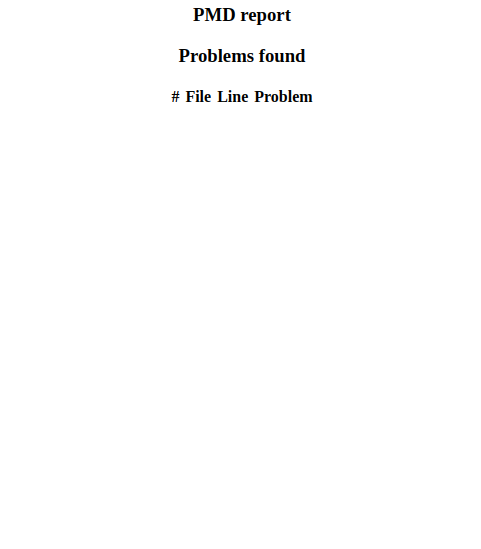
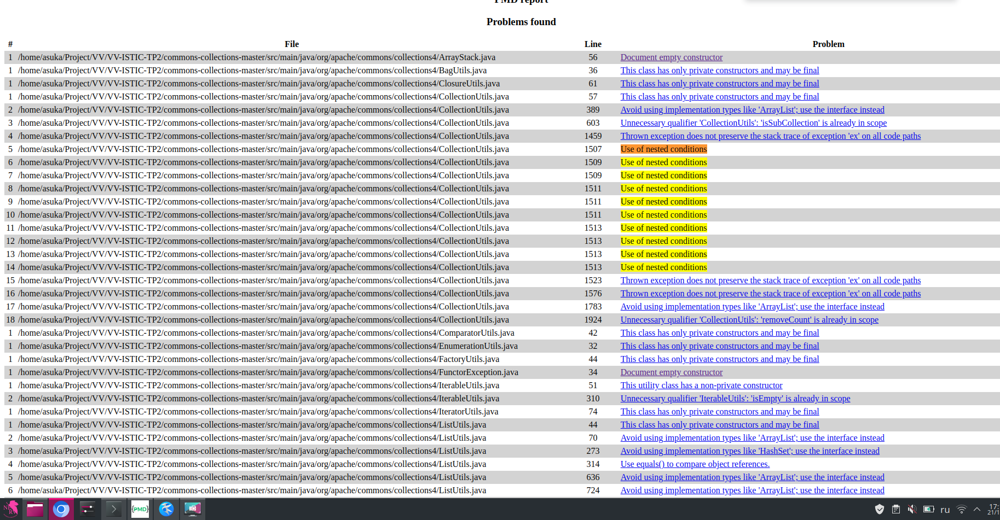
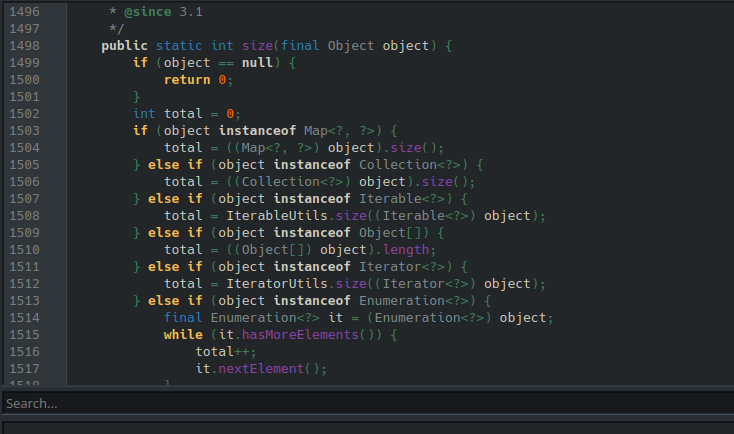

# Extending PMD

Use XPath to define a new rule for PMD to prevent complex code. The rule should detect the use of three or more nested `if` statements in Java programs so it can detect patterns like the following:

```Java
if (...) {
    ...
    if (...) {
        ...
        if (...) {
            ....
        }
    }

}
```
Notice that the nested `if`s may not be direct children of the outer `if`s. They may be written, for example, inside a `for` loop or any other statement.
Write below the XML definition of your rule.

You can find more information on extending PMD in the following link: https://pmd.github.io/latest/pmd_userdocs_extending_writing_rules_intro.html, as well as help for using `pmd-designer` [here](https://github.com/selabs-ur1/VV-ISTIC-TP2/blob/master/exercises/designer-help.md).

Use your rule with different projects and describe you findings below. See the [instructions](../sujet.md) for suggestions on the projects to use.

## Answer

To define a new rule for PMD using XPath, we did the following. We opened PMD Designer, wrote the code there and exported it to an .xml file. After exporting, the result file had the following contents:
```
<rule name="TripleIFOrMore"
      language="java"
      message="Use of nested conditions "
      class="net.sourceforge.pmd.lang.rule.XPathRule">
   <description>

   </description>
   <priority>3</priority>
   <properties>
      <property name="version" value="3.1"/>
      <property name="xpath">
         <value>
<![CDATA[
//IfStatement//IfStatement//IfStatement

]]>
         </value>
      </property>
   </properties>
</rule>
```
Next, we added a new rule to the quickstart.xml file to consolidate all rules in one file. To test the newly written PMD test, we used the file /home/asuka/Project/VV/VV-ISTIC-TP2/commons-collections-master/src/main/java/org/apache/commons/collections4/ArrayUtils.java. In this file, the 'if' statements follow one another but are not nested. As a result, the testing produces a result as shown in the screenshot 'EX_3_Figure_1.png' indicating that the rule is not violated.



If you run the testing for the entire directory, the result will be as shown in the 'EX_3_Figure_2.png' screenshot. 

Navigating to the file with the detected issue and going to the relevant line, we see the code as shown in the 'EX_3_Figure_3.png' screenshot. From the code, it is evident that our test identified an error, although at first glance, it may not seem to fit our condition. Upon closer inspection, we understand that the code written in lines 1503 to 1514, during compilation and conversion to bytecode, becomes the same nested 'if' statement


