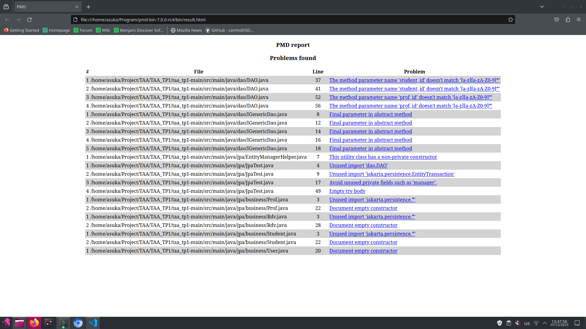

# Using PMD

Pick a Java project from Github (see the [instructions](../sujet.md) for suggestions). Run PMD on its source code using any ruleset. Describe below an issue found by PMD that you think should be solved (true positive) and include below the changes you would add to the source code. Describe below an issue found by PMD that is not worth solving (false positive). Explain why you would not solve this issue.

You can use the default [rule base](https://github.com/pmd/pmd/blob/master/pmd-java/src/main/resources/rulesets/java/quickstart.xml) available on the source repository of PMD.

## Answer

Several issues were identified from the project PMD issue. One of the identified issues, which can be considered a true positive, concerns the naming of method parameters in the DAO.java class. The PMD reports that method parameter names do not follow the CamelCase pattern. EX_2_Figure_1.png.



## For example, in the code of the class DAO.java:
```
java
Copy code
public class DAO {
    public void someMethod(int student_id) {
    }

    public void anotherMethod(int prof_id) {
    }
}
```
The names of the student_id and prof_id parameters do not match the recommended naming pattern.

To fix this problem, you can rename the method parameters to match the required pattern, for example:
```
java
Copy code
public class DAO {
    public void someMethod(int studentId) {
    }

    public void anotherMethod(int profId) {
    }
}
```
The parameter names studentId and profId now conform to the common variable naming style in Java.

However, among the issues found, there are also cases that may be false positives. For example, PMD points to an unused import of jakarta.persistence.* in the Prof.java class. This import may actually be used in other parts of the project or may be left as a pre-requisite for future code. In such cases, removing this import may be an unnecessary and wrong action, as it may be used in other parts of the project in the future.